# 动漫电影票房预测

项目是本人在2021年12月独立完成的，原为大二上学期科学计算程序设计基础结课项目，后来有一些补充。

## 项目简介

根据动漫电影上映短期内的信息预测其总票房有很大的实际意义。对于瞄准动漫电影映后经济价值开发的投资者来说，往往需要根据电影上映后短期内的表现来做出投资决定；负责电影推广宣传的相关机构也需要在上映短期内及时判断进一步宣传的必要性以及宣传力度，从而节约成本，最大化效益；影院也需要为排片等决策提供依据；相关机构可以根据预测结果决定是否提前开始动漫衍生品的开发，抢占市场等等。

本项目拟构建动漫电影票房预测模型，根据上映短期内的信息进行动漫电影票房区间的分类预测，并实现图形界面。具体任务如下：

1. 利用Python中Appium, Seleium从手机app“猫眼专业版”爬取相关数据，研究并设计合适的指标。

2. 构建基于多个子分类器集成的硬投票器，实现对动漫电影票房的预测。模型输入是我们设计的指标：首日票房，百度指数峰值，是否在热门档期，电影类型，IP信息，以及是否为续集，模型输出为模型预测的该电影所处的票房区间。票房区间分为3亿以上、1亿到3亿、1千万到1亿、5百万到1千万以及5百万一下。
   
3. 实现图形交互界面。输入所选择的子分类器以及指标参数，返回投票预测结果。

## 项目框架

通过查阅文献，结合实际分析确定指标，然后利用Python中的Appium、Selenium库设计爬虫程序，从手机app“猫眼专业版“上爬取和收集数据，共收集250条数据，之后利用pandas库进行数据的预处理以及统计分析，处理好后的样本共152条。

准备好数据后，利用sklean库分别建立了随机森林、XGBoost、GBDT、决策树模型进行票房区间的分类预测，随后不借助sklearn库，自己设计了一个硬投票器（Hard Voting）进行分类预测，并做交叉验证对模型进行评估。最后借助Tkinter实现图形界面。

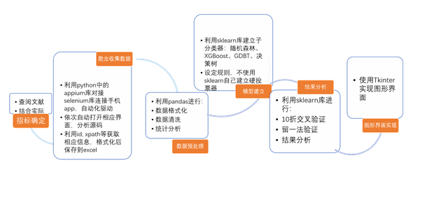

## 成果展示

1. 数据描述性统计

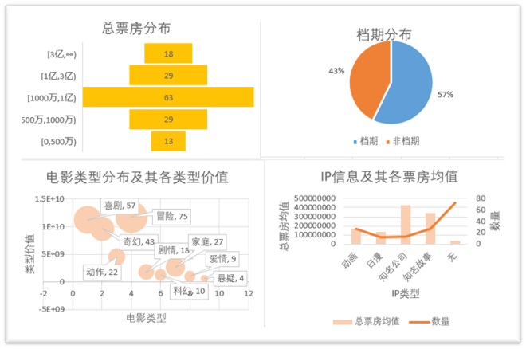

2. 模型十折交叉验证结果
   
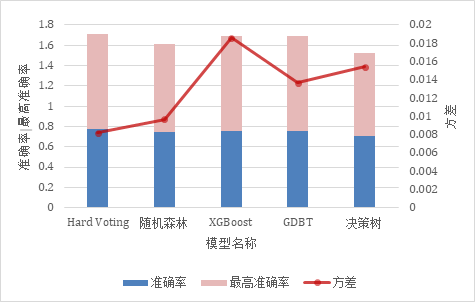

2. 留一法结果

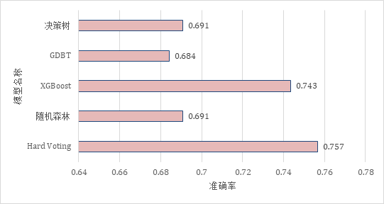

3. Kappa系数

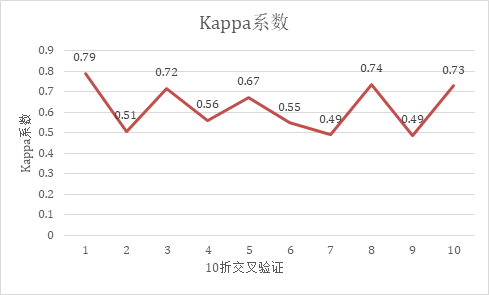

4. GUI展示

启动程序。可以看到首页：
	                      
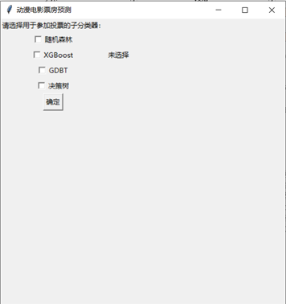

为了演示，我们选择三个子分类器：随机森林、XGBoost，GBDT。选择时右侧语句会随着打勾发生变化：

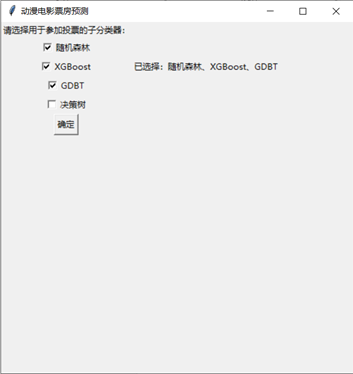
 
点击确定后，进入主界面：
 
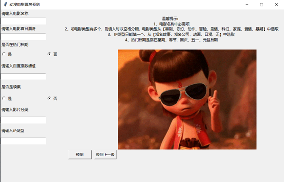

按照提示输入参数，在此我们输入电影《千与千寻》的信息，输入如下：

点击预测，出现子窗口：

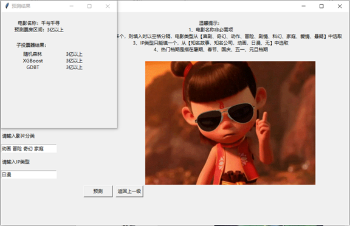

《千与千寻》于2019年6月21日在大陆上映，总票房4.88亿，预测正确。关闭子窗口，点击返回上一级，则回到首页。

每次打开预测界面，背景图片随机切换，目前共有4张背景。

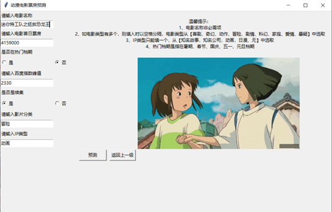

   
1. 指标重要性
   
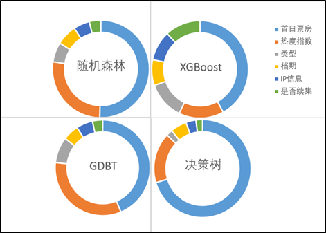

6. 其他数据可视化

决策树可视化：

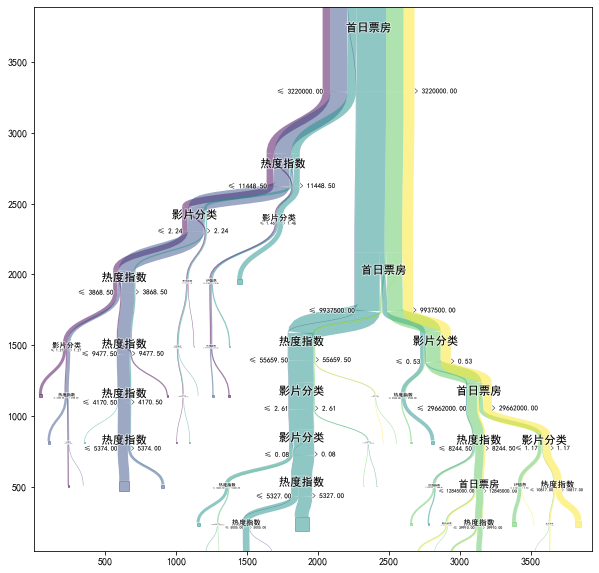
   
旭日图：

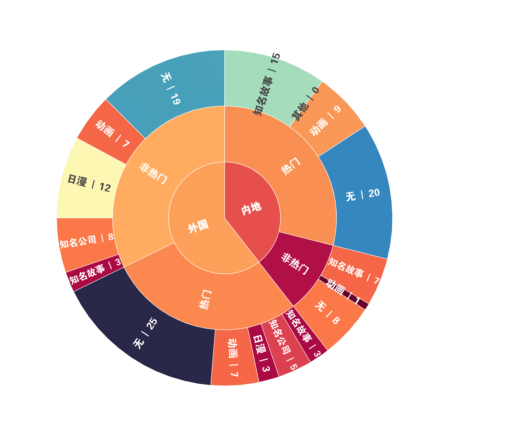

桑基图：

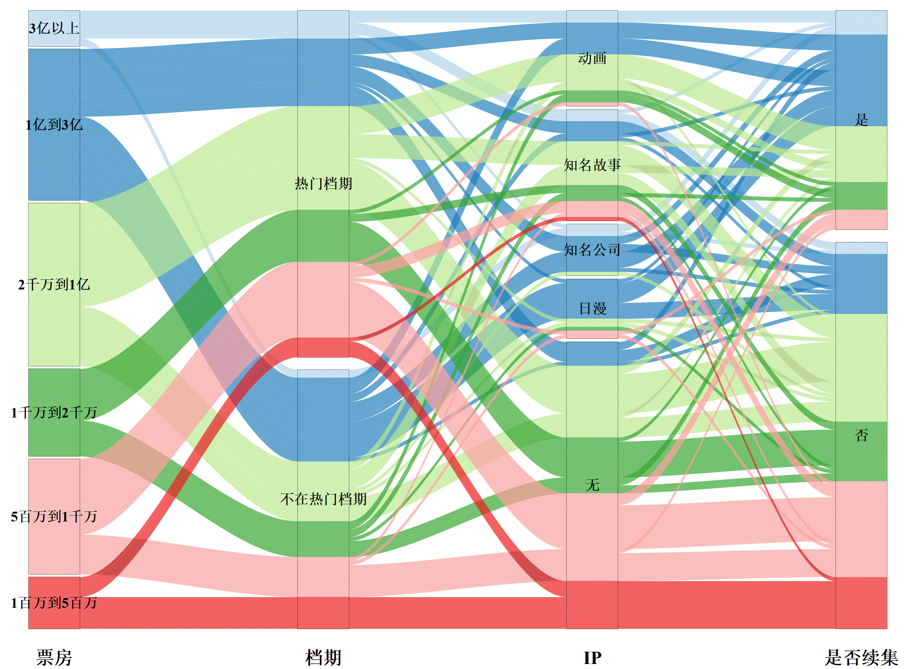

## 项目和代码细节

1. 指标确定

对动漫电影而言，导演、主演影响力的作用微乎其微。而且我们针对的是根据上映短期内的表现来预测总票房，豆瓣关注度、豆瓣评分都是在电影上映一段时间后才形成和稳定，不具有采纳价值。但是我们认为对动漫电影来说，电影类型、续集以及其IP信息是值得考虑的因素。而且上映短期内的口碑和网络热度对后续票房的增长作用显著。在寻找数据源时我们发现，上映电影的百度指数峰值往往出现在上映后几天之内，其他热度指数比如微博指数等也具有参考意义，但是我们认为其于百度指数之间相关性较强，可以用百度指数代替。

综合上述考虑，我们将首日票房、百度指数峰值、电影类型、IP信息、档期、是否续集作为我们的指标。

2. 爬虫收集数据

借助Python中的Appium库来实现数据爬取。我们爬取的对象是手机app猫眼专业版。
爬虫部分由三个函数构成，分别负责连接手机并进入app、爬取一页上的数据、重复调用前两个函数并实现数据的全部爬取。

Appium是一个跨平台的移动端自动化测试工具。它可以模拟App内部的各种操作，比如点击、滑动、文本输入等，并通过WebDriver来实现app的自动化测试，同Selenium在PC端一样，做到“可见即可爬”。Python中提供了appium库并且可以通过webdriver与selenium库实现对接。

猫眼专业版app中有齐全的电影数据，于是将它作为爬虫的对象。2017年以前的总票房只有分账票房，不包含电商服务费，因此考虑到分析简便以及信息的时效性，选择2017年到2021年上映的票房在100万以上的动漫电影作为样本。

爬虫程序三个函数及功能介绍：

- `main()`函数：

首先传入server信息以及建立Session所需参数（手机型号等），利用appium中的webdriver的Remote方法连接手机，产生driver对象。随后利用selenium中的WebDriverWait函数产生wait对象，产生wait对象的主要目的是可以进行延时等待，如想要点击某按钮时可以等待其加载完成出现，而不至于加载时发现不了该按钮导致报错。

随后调用`enter_datafile(wait,driver)`函数进入猫眼专业版app 的资料库。

最后进行数据的爬取。由于crawl函数最多对同一个页面上5个电影进行爬取，因此需要调用crawl函数50次。而且在实际应用中观察发现，driver中用于滑动界面的swipe()函数不稳定，即使设置完全相同的参数，每次滑动的距离也不一样，因此在两次crawl函数之间只能手动在手机上滑动屏幕。一次crawl()完成后，程序会发出提示，要将下五个滚动到指定位置。利用time模块的sleep函数给手动工作提供时间。

每次调用的结果先以字典的形式存储到back_up变量中，键是电影名称，值为总票房、首日票房、影片分类、上映日期、热度指数组成的列表。

爬取完成后，利用pandas将字典转化成excel保存，命名为总原始数据.xlsx。

- `enter_datafile(wait,driver)`函数：

此函数接收两个参数，就是上面提到的wait对象和driver对象。进入app的主要过程如下：先在同意协议界面点击同意，然后进入资料库，随后选择时间段，选择电影类型为“动漫”。主要用到了wait的until()方法，driver的tap()方法。前者能够根据ID，xpath等选择对象，并且能够提供对象的click()方法模拟点击。后者接收位置参数，直接模拟手指在屏幕上对应位置进行点击。

- `crawl(wait,driver)`函数：

连接手机，打开资料库后，在Appium Inspector中可以看到的界面如下：

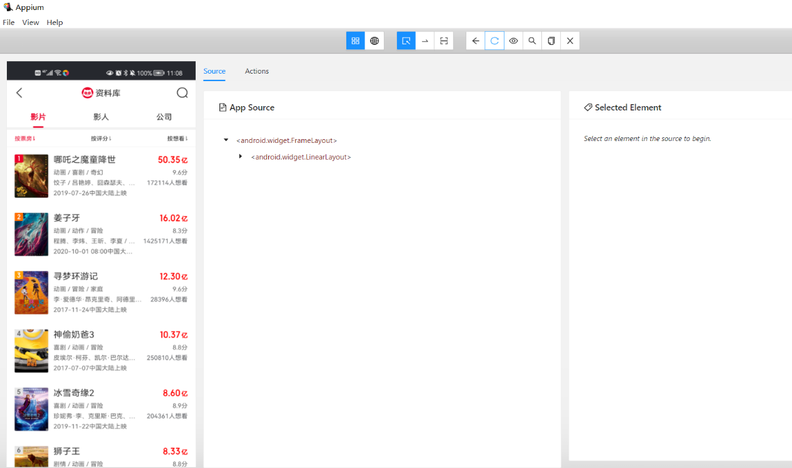

可以看到，在同一界面中有五个完全显示出来的电影。crawl函数的思路是：通过driver的tap方法依次点击五个电影的图片，进入对应电影的资料卡，然后在资料卡中找到想要的信息，通过ID。Xpath获取节点，再获取text属性，就获取到了我们想要的。

 资料卡举例如下：

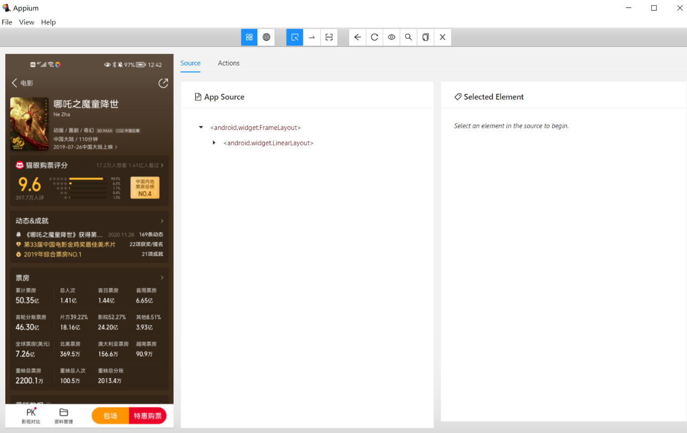

在此界面中，我们想要的信息有：总票房，首日票房，电影类型、上映时间。事实上，稍微往下滑动，就可以看到百度指数峰值信息，这个滑动是通过`swipe()`来实现的，因为这里不需要滑动准确，只需稍微往下滑动，看到节点即可。通过点击信息，我们可以在上述界面的最右侧看到节点的ID，xpath等信息，比如电影类型的ID就是`'com.sankuai.moviepro:id/tv_type'`。在`wait.until()`中传入此参数，再获取text属性，就获得了此电影类型的信息。如法炮制获取此电影的其他信息。然后调用driver的`back()`方法，回到上一层界面，同样的方法进行下一个电影的爬取，一直到五个电影都爬取完成，`crawl()`的一次调用就结束。

在实际爬取的过程中，由于xpath的复杂性以及数据偶尔缺失，函数会因为找不到节点而报错，为了应对这种情况，我们设置了异常处理`try`, `except`结构，如果获取不到，就返回“暂无 ”信息，保证了程序能够完整进行而不中断。

爬虫程序运行过程截图如下：
 
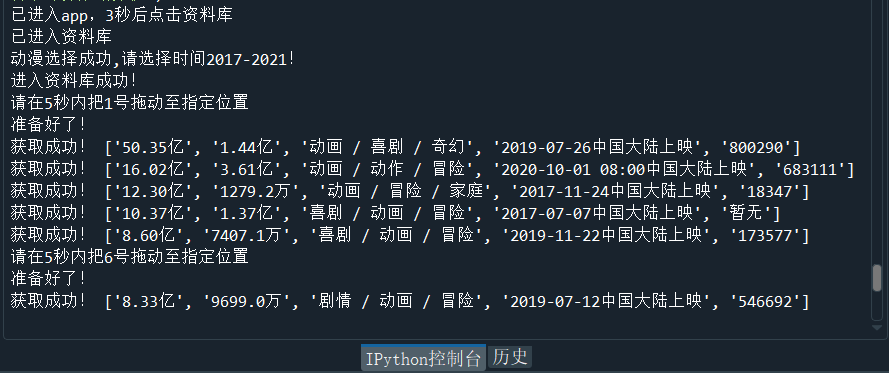

爬取获得的原始数据部分展示如下：

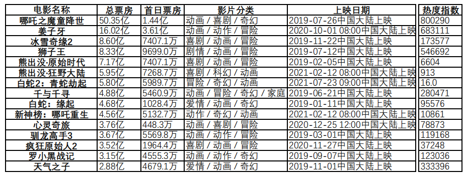

3. 数据处理

在收集数据的过程中我们发现百度指数峰值一列有非常多的缺失数据和异常数据。数据异常实际上也是数据的缺失，因为猫眼专业版app在百度指数缺失的情况下会用微信文章阅读数等来代替。于是我们先进行了缺失数据的剔除。剔除完成后，对剩下的29条异常数据，采取将他们的指数用他们所在票房区间的热度指数平均值代替。F档的热度指数则统一用1000代替，因为该段的热度指数波动较大，用平均值代替不符合实际情况。且经过实际的观察，1000是F档合适的数值。
首先将总票房、票房数据从文本型转化为数字型。其中总票房被分为3亿以上、1亿到3亿、1千万到1亿、5百万到1千万，5百万以下。

随后对档期进行处理。习惯上一般将电影档期分为春节档、暑期档、国庆档、元旦档、五一档等等。将所有日期分为2类，出于热门档期记为1，否则为0。

然后针对一个电影有多个类型的情况，采取得分的方式。得分公式如下：

$$
TypeScore_i = \sum_{j=1}^{n_i} \left(\ln\frac{T_j}{T_{min}}\right) / \left(\ln\frac{T_{max}}{T_{min}}\right)
$$

其中$T_j=\sum_{k=1}^{n_j} Box_{jk}$, $T_{max} = \max\{T_1,T_2,\cdots,T_9\}$, $T_{min} = \min\{T_1,\cdots,T_9\}$。

$TypeScore_i$表示i电影的类型得分，$n_i$代表$i$电影具有的类型数量。$T_j$代表$j$类型的总价值，$n_j$代表$j$类型的电影数目，$Box_{jk}$代表j类型电影$k$的票房。$T_{max}$和$T_{min}$分别为所有类型中类型价值的最高者和最低者。

4. 模型建立

应用Python中Sklearn库和xgboost库来实现硬投票器的建立。
 
其中XGboost模型来自xgboost库，随机森林，GBDT，决策树模型来自sklearn库。硬
投票器的原理是，每个子投票器都对样本做出预测，最后总投票器取子投票器结果众数作为最终结果。

硬投票器（Hard Voting）是一种集成算法，我们设计的硬投票器基本过程如下：先用
训练数据训练四个子分类器，然后用子分类器分别对所有测试样本进行分类，并存储它们的准确率信息。然后遍历每个测试样本，选择所有子分类器在该样本上输出结果最多的类别作为最终的分类结果。对于有争议的情况，比如四个分类器结果各不相同，或者四个分类器的分类结果恰好分成两组，类似情况下则选择准确率最高的子分类的结果作为输出。

设计函数`voting(m1,m2,m3,m4,E)`接收四个子分类器m1,m2,m3,m4,E为训练集，训练标签
集，测试集，测试标签集组成的列表。此函数返回对测试集的投票结果。投票的过程如上所述。

函数`find_m_often(array)`用于voting中。用于接收四个子分类器的分类结果并返回票数最多的结果，如果出现争议则返回False。

5. 模型评估
   
考虑到样本数量较少，因此采用K折交叉验证的方法进行训练和评估。10折交叉验证将样本分为10份，每次用其中的9份进行训练，用剩下的1份进行验证，取10次验证结果准确率的平均值作为准确率。留一法也是一种K折交叉验证，此处K等于样本个数。即每一次用除了一个样本之外的所有数据训练，然后对这一个数据进行验证，最后准确率取正确结果的个数除以样本总数。

设计`k_fold_validation(k)`函数用于对子分类器表现进行评估。该函数接受折数k，返回四个
子分类器k折交叉验证各自的k个准确率组成的矩阵。

`voting_k_fold_validation(k,X,y)`函数对硬投票器的表现进行评估，该函数接受折数k，总数
据集X和总标签集y，返回k个准确率信息组成的数组。

6. GUI设计

- 首页

首页用于选择用于投票的子分类器，至少选择一个，可以选择四个。点击对应位置可以选择模型。选择后右侧的语句会有变化，显示已被选择的模型。选择好后，点击确定可以进入下一页面。

这一过程被打包为函数`step1()`。当用户点击确定时，调用`Tk()`对象的`destroy()`方法将此窗口关闭，并将子分类器的被选择情况传给下一个即将打开的窗口。为实现选择情况的信息传递，设计函数`step2(check_situation, final_models)`，此函数接收两个参数，`check_situation`为一个长度为4的列表，由0，1组成，代表模型的被选择情况。`final_models`也是列表，内容为被选中的、已经训练好的模型。并且此函数将会创建新的窗口，也就是我们的主界面。

- 主界面

主界面由多个交互区域、温馨提示、图片、确定和返回上一级按钮组成。交互区域以问答的形式接收即将预测的样本的参数。温馨提示展示了接收参数的规则。图片库共有4张，每次开启窗口会在四张之间切换。点击确定按钮则对输入的样本进行硬投票预测，并且弹出子窗口进行预测结果的展示。返回按钮则调用主界面窗口对象的`destroy()`方法，并且运行`step1()`，召回首页。

- 子窗口

子窗口展示预测的结果，并且展示所选择的每个子分类器的结果。
